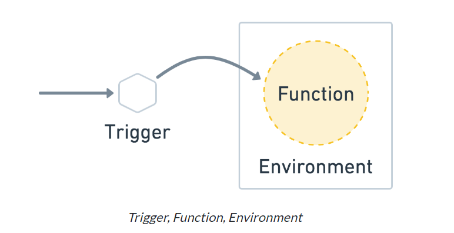

# Concepts
### Concepts of Fission architecture

- Fission has three main concepts: Functions, Environments, and Triggers.




# Functions

A **Fission function** is essentially a block of code that is executed in response to an event or request. It's a core concept in **Serverless computing**, where you deploy functions that are run in response to events rather than maintaining an always-on server.

### What is a Fission Function?
In Fission, a function typically refers to a small, stateless piece of code that is executed on demand. It often contains a single **entry point** — a function that is invoked when the Fission runtime handles an event.

#### Function Characteristics:
- **Single Entry Point**: A function typically has one **main entry point**, which can be invoked by Fission.
- **Event-Driven**: Functions are triggered by events, such as HTTP requests, file uploads, etc.
- **Stateless**: Functions do not retain state between executions, meaning every function invocation is independent of the others.

In a serverless environment like Fission, you don't need to worry about server management. Instead, you write functions and deploy them, and Fission manages scaling and execution based on demand.

### Example: JavaScript Function

Here's the example you provided in JavaScript:

```javascript
module.exports = async function(context) {
    return {
        status: 200,
        body: "hello, world!\n"
    };
}
```

### Explanation:
1. **`module.exports`**: In Node.js (JavaScript runtime), you export the function using `module.exports`. This makes the function available to the Fission runtime when it is invoked.
2. **`async function(context)`**: The function is asynchronous, meaning it can handle asynchronous operations (like I/O operations or HTTP requests). The `context` parameter holds information about the runtime environment or the request context (such as headers, data, etc.).
3. **Return Object**: The function returns an object with two properties:
   - `status`: HTTP status code (`200` means success).
   - `body`: The content to be returned (`"hello, world!"` in this case).

When this function is executed by Fission, it will respond with a 200 status code and the text `"hello, world!"`.

### Why is this Just a Function?
This is a minimal **Serverless function**:
- It handles one task (responding with a message).
- It is **stateless** (no need for any persistent data between invocations).
- The function is invoked on demand, typically by an **HTTP request** or another event.
- The function is **self-contained**: it doesn't rely on any external infrastructure. The only dependencies it needs are the ones you explicitly specify (e.g., libraries).

### More Examples of Fission Functions:

#### Python Function (Flask Example)
```python
def handler(context):
    return {
        "status": 200,
        "body": "Hello from Python!"
    }
```

In this example, the function returns a greeting message. You can deploy this Python function in Fission, and it will execute when invoked.

#### Go Function (Simple HTTP Handler)
```go
package main

import (
	"fmt"
	"github.com/fission/fission"
)

func main() {
	fission.HandleFunc(func(w http.ResponseWriter, r *http.Request) {
		fmt.Fprintf(w, "Hello from Go!")
	})
}
```

Here, we define a Go function that handles HTTP requests and returns `"Hello from Go!"` when triggered.

### Why "Small Code" is Just a Function
- **Simplicity**: A function is a small, isolated unit of work. It’s designed to do one thing and do it well, in a clear and understandable way.
- **Focus on Task**: By focusing on a single task (like returning a greeting), functions are **stateless** and **event-driven**, making them ideal for scenarios where only a single operation is required in response to an event.
- **Scalability**: Functions can scale independently. When there's a high demand (multiple requests), the platform (like Fission) automatically creates more instances of the function, all without the need to manage infrastructure manually.

### Why Functions in Serverless Architecture?
- **Cost Efficiency**: Since you only pay for execution time, serverless functions can be more cost-effective than maintaining a traditional server that runs constantly.
- **Simplified Deployment**: You don't have to worry about managing servers, networking, or scaling. You simply deploy the function, and the system takes care of the rest.
- **Auto-Scaling**: Serverless platforms scale the functions up or down based on demand. When a function is invoked, an instance of the function is created to process the request. If more requests come in, more instances are created automatically.

### When Should You Use Fission Functions?
You can use Fission functions for various use cases:
- **API Endpoints**: Building APIs where each endpoint is a function.
- **Event-Driven Computing**: Triggering functions in response to events such as file uploads, database changes, etc.
- **Data Processing**: Performing data processing tasks (like image resizing, video encoding, etc.) in response to events.
- **Microservices**: Each function can serve as a microservice that handles a specific task, making it easy to scale individual parts of your application independently.


# Environments
Environments are the language-specific parts of Fission. An Environment contains just enough software to build and run a Fission Function.

Since Fission invokes Functions through HTTP, this means the runtime of an environment is a container with an HTTP server, and usually a dynamic loader that can load a function. Some environments also contain builder containers, which take care of compilation and gathering dependencies.

You can modify any of Fission’s existing environments and rebuild them, or you can also build a new environment from scratch.

Check out the complete list of Fission Environments [link](https://fission.io/docs/usage/languages/).
---

### Languages (Environment)
Environments provide a runtime that is used to execute functions.

Below are the pre-built environments currently available for use in **Fission**:

| **Environment** | **Image** | **Builder Image** | **v1** | **v2** | **v3** |
|-----------------|-----------|-------------------|--------|--------|--------|
| **NodeJS**      | ghcr.io/fission/node-env | ghcr.io/fission/node-builder | O | O | O |
| **Python 3**    | ghcr.io/fission/python-env | ghcr.io/fission/python-builder | O | O | O |
| **Go**          | See here for more info | - | O | O | O |
| **JVM (Java)**  | ghcr.io/fission/jvm-env | ghcr.io/fission/jvm-builder | O | O | O |
| **Ruby**        | ghcr.io/fission/ruby-env | ghcr.io/fission/ruby-builder | O | O | O |
| **Binary (for executables or scripts)** | ghcr.io/fission/binary-env | ghcr.io/fission/binary-builder | O | O | O |
| **PHP 7**       | ghcr.io/fission/php-env | ghcr.io/fission/php-builder | O | O | O |
| **.NET 2.0**    | ghcr.io/fission/dotnet20-env | ghcr.io/fission/dotnet20-builder | O | O | O |
| **.NET**        | ghcr.io/fission/dotnet-env | - | O | X | X |
| **Perl**        | ghcr.io/fission/perl-env | - | O | X | X |

For the latest info on available environments, refer to the [Environment Portal](https://fission.io/environments/).

---

### Environment Interface Versions

Fission supports three environment interface versions: **v1**, **v2**, and **v3**.

#### v1
- Support loading function from a **single file**.
- Mainly for **interpreted languages** like **Python** and **JavaScript**.
- **Cannot specify entrypoint** if there are multiple entry points in the file.

#### v2 (Recommended)
- Function code can be placed in a **directory** or have **multiple entry points** in a single file.
- **Supports loading function by specific entrypoint**.
- Optionally supports **downloading dependencies** and **source code compilation**.

#### v3 (Recommended)
- Includes all features from **v2**.
- Allows adjustment of the **pre-warmed pool size**.

---

### Which Interface Version Should We Choose?
- **v1**: If all source code and dependencies can fit into a single **non-compiled file**, the v1 interface is sufficient.
- **v2**: Recommended if the function requires **third-party dependencies** or is written in a **compiled language**. Use this version for functions with **directories/binaries** and **specific entry points**.
- **v3**: Recommended if you want to adjust the **size of the environment's pre-warmed pool**.

---

### Using a Specific Environment Interface Version
We can specify the version while creating an environment using the `--version` option:

```bash
# Example: To create a Go environment with version 3 interface
fission environment create --name go --image ghcr.io/fission/go-env-1.23 --builder ghcr.io/fission/go-builder-1.23 --version 3
```

---

This reformat organizes the information neatly, making it easier to follow and understand the supported environments, interface versions, and usage.


# Triggers

In Fission, **triggers** are what allow us to invoke or execute a function. Let’s break this down clearly:

---

### **What is a Trigger in Fission?**
A **trigger** is like a signal or event that "triggers" (calls) a Fission function. It connects a specific event or condition to your function so that the function gets executed whenever the trigger occurs.

---

### **Types of Triggers in Fission**
1. **HTTP Trigger**  
   - Most common type.  
   - You associate an HTTP request (like a GET, POST) with a function.  
   - Whenever a request comes to a specific URL, Fission runs the function.
   - Example:  
     - **Trigger**: HTTP request to `http://<fission-url>/hello`  
     - **Action**: Calls the function `hello-js` and returns the result.

2. **Time Trigger (Cron)**  
   - Used to run functions at scheduled times.  
   - Example: Run a function every hour or daily at 10:00 AM.

3. **Message Queue Trigger (MQ)**  
   - Connects functions to message queues like Kafka, NATS, or RabbitMQ.  
   - Example: Whenever a new message appears in a Kafka topic, a function processes it.

4. **Kubernetes Watch Trigger**  
   - Watches for changes in Kubernetes resources (e.g., Pods, ConfigMaps) and triggers a function when a change is detected.

5. **Custom Trigger**  
   - You can create custom logic for triggering functions based on specific use cases.

---

### **How Triggers Work**
1. **Setup:**  
   - When you create a trigger, you link it to a specific function and define the conditions or events for invoking the function.

2. **Execution:**  
   - When the event occurs (e.g., an HTTP request, a time schedule, or a Kafka message), Fission automatically pulls the function code, runs it in the appropriate environment, and returns the output.

---

### **HTTP Trigger Example**
Let’s look at how an HTTP trigger works practically:

#### Steps:
1. **Create a Function**  
   ```bash
   fission function create --name hello-js --env nodejs --code hello.js
   ```

2. **Create an HTTP Trigger**  
   ```bash
   fission route create --method GET --url /hello --function hello-js
   ```

3. **Test the Trigger**  
   - Send a request:  
     ```bash
     curl http://<fission-ip>:<port>/hello
     ```  
   - Output: `hello, world!`

#### What Happens:
- You hit the `/hello` endpoint.  
- The HTTP trigger detects this and forwards the request to the `hello-js` function.  
- Fission runs the function and returns the result.

---

### **Benefits of Triggers**
- **Seamless Invocation:** You don't need to worry about how to execute the function—it just works when the trigger condition is met.
- **Event-Driven:** Functions only run when needed, saving resources.
- **Flexibility:** Triggers let you connect functions to different kinds of events (HTTP, time-based, messages, etc.).

---


Fission supports multiple ways to trigger functions beyond the basic HTTP trigger. These triggers allow us to invoke functions based on different events or conditions. Here’s an overview:

---

### **1. HTTP Trigger**
- **What It Does**: Maps an HTTP endpoint (like `/hello`) to a function.
- **Usage**: Useful for web services, APIs, or when directly calling functions over HTTP.
- **Example**:
  ```bash
  fission route create --method GET --url /hello --function hello-js
  ```
  - Accessible at `http://<router-ip>:<port>/hello`.

---

### **2. Timer Trigger**
- **What It Does**: Invokes a function at a specified time interval (like a cron job).
- **Use Case**: Periodic tasks, such as generating reports, sending emails, or cleanup jobs.
- **Example**:
  ```bash
  fission timer create --name daily-cleanup --cron "0 2 * * *" --function cleanup-func
  ```
  - Runs the `cleanup-func` every day at 2:00 AM.

---

### **3. Message Queue Trigger**
- **What It Does**: Invokes a function when a message is published to a queue (e.g., Kafka, NATS).
- **Use Case**: Asynchronous processing, event-driven architecture, or integrating with external systems.
- **Supported Queues**: Kafka, NATS, Azure Queue Storage, and more.
- **Example** (for Kafka):
  ```bash
  fission mqtrigger create --name kafka-trigger --function process-func --mqtype kafka --topic my-topic --resptopic response-topic
  ```
  - Triggers `process-func` when a message is published to `my-topic`.

---

### **4. Kubernetes Watch Trigger**
- **What It Does**: Invokes a function when a Kubernetes resource changes (e.g., creation, update, deletion).
- **Use Case**: Automating Kubernetes resource management, like scaling or logging.
- **Example**:
  ```bash
  fission kubewatch create --name pod-watcher --namespace default --type Pod --function log-pod-events
  ```
  - Runs `log-pod-events` whenever a Pod in the `default` namespace changes.

---

### **5. Generic Trigger**
- **What It Does**: Allows external systems to trigger functions programmatically.
- **Use Case**: Flexibility to integrate Fission with custom event sources.
- **Example**:
  - Write custom code to call Fission's API to trigger a function.

---

### **6. Canary Config (Advanced Trigger)**
- **What It Does**: Implements traffic-splitting for rolling out function updates (e.g., blue-green or canary deployments).
- **Use Case**: Safely testing updates to a function without affecting all users.
- **Example**:
  ```bash
  fission canary-config create --name test-canary --function new-func --weight 10
  ```
  - Directs 10% of traffic to the new version (`new-func`) while 90% goes to the old.

---

### **7. Event Source Trigger (via Fission Events Add-On)**
- **What It Does**: Integrates with event sources like GitHub webhooks, cloud events, or IoT devices.
- **Use Case**: Event-driven workflows, integrating with GitOps pipelines or external systems.
- **Example** (for GitHub):
  ```bash
  fission github webhook create --repo-url https://github.com/user/repo --function process-webhook
  ```
  - Runs `process-webhook` whenever a GitHub event occurs.

---

### **Choosing the Right Trigger**
| **Trigger Type**         | **Best For**                                                   |
|---------------------------|---------------------------------------------------------------|
| HTTP Trigger              | APIs, webhooks, or interactive HTTP calls.                   |
| Timer Trigger             | Periodic, scheduled jobs.                                    |
| Message Queue Trigger     | Asynchronous event-driven processing.                        |
| Kubernetes Watch Trigger  | Responding to Kubernetes events dynamically.                 |
| Canary Config             | Progressive traffic control for updates.                     |
| Event Source Trigger      | Reacting to external events like GitHub actions or IoT data. |

---

### **Trigger Configuration Tips**
1. **Router Configuration**: Make sure the router has sufficient resources to handle the trigger type.
2. **Namespace Isolation**: Use Fission namespaces to isolate triggers for different environments (e.g., `dev`, `prod`).
3. **Scaling**: Ensure the function pool scales appropriately for high-frequency triggers.


## Understanding with an example :


- commands:
```
- gets us a temp node running env
C:\Users\ashfa\OneDrive\Desktop\My-Learning\fission\fission\samples\node>fission env create --name nodejs --image ghcr.io/fission/node-env
poolsize setting default to 3
environment 'nodejs' created


- gets us the code which will run on env .
C:\Users\ashfa\OneDrive\Desktop\My-Learning\fission\fission\samples\node>curl -LO https://raw.githubusercontent.com/fission/examples/main/nodejs/hello.js
  % Total    % Received % Xferd  Average Speed   Time    Time     Time  Current
                                 Dload  Upload   Total   Spent    Left  Speed
100   119  100   119    0     0    284      0 --:--:-- --:--:-- --:--:--   285


 - takes the code and runs on top of temp node env.
C:\Users\ashfa\OneDrive\Desktop\My-Learning\fission\fission\samples\node>fission function create --name hello-js --env nodejs --code hello.js
Package 'hello-js-c105c968-df91-4fcc-8e02-e4e4a466d93b' created
function 'hello-js' created

- calling the function.

C:\Users\ashfa\OneDrive\Desktop\My-Learning\fission\fission\samples\node>fission function test --name hello-js
hello, world!

```

- code which we downloaded :

```

module.exports = async function(context) {
    return {
        status: 200,
        body: "hello, world!\n"
    };
}

```

##  IMP Working explained  :

 Let's break this down in detail, starting with **how normal JavaScript code execution works** and then comparing it with **what Fission does**. and we will see the specific query about Node.js execution and shutdown as well in fission.

---

### **1. How Does Normal JavaScript Code Execution Work?**

When we write JavaScript (JS) code and execute it:

1. **Runtime Setup:**
   - we need **Node.js** installed locally or on a server.
   - Node.js provides the JavaScript runtime and the environment to execute our code. This includes features like asynchronous I/O, an event loop, and access to file systems, etc.

2. **Running the Code:**
   - we execute the JS file using the `node` command:
     ```bash
     node hello.js
     ```
   - The process starts the Node.js runtime, loads your JavaScript code, executes it, and then exits (if there's no long-running task like an HTTP server).

3. **Manual Scaling and Management:**
   - If we want this code to respond to multiple users (e.g., serve HTTP requests), you need to:
     - Write additional logic (like using `http` or `express` modules).
     - Deploy it on a server or container.
     - Manually manage scaling, restarts, updates, etc.

---

### **2. How Does Fission Work?**

With **Fission**, we move from a **code-centric approach** to a **function-centric approach**. Here's how it differs:

#### **Step-by-Step Process in Fission:**

1. **Predefined Runtime (Environment):**
   - Fission provides ready-made runtime environments for languages like Node.js, Python, etc. (e.g., `ghcr.io/fission/node-env`).
   - we don’t need to install or manage Node.js. Fission pulls the containerized environment automatically.

2. **Function Deployment:**
   - Instead of running an entire application, we only deploy small, **single-purpose functions** like `hello.js`.
   - Fission takes care of:
     - Packaging our function.
     - Associating it with the appropriate runtime.
     - Storing it in Kubernetes (ConfigMap, Secrets, or Persistent Volumes).

3. **Lazy-Loading Execution:**
   - When we invoke a function for the first time, Fission:
     - Selects an idle pod from the pool of pre-warmed containers (in this case, Node.js runtime pods).
     - Loads our function (e.g., `hello.js`) into the pod and executes it.
   - Once the function is loaded, subsequent requests are faster (until the pod is scaled down during inactivity).

4. **Scaling and Lifecycle:**
   - **Scaling:** Fission dynamically scales the environment pods up or down based on demand.
   - **Shutdown:** When a pod is idle for too long, Fission automatically scales it down to zero, saving resources.

---

### **Key Differences Between Normal JS Execution and Fission**

| **Aspect**               | **Normal JS Execution**                | **Fission Function Execution**                             |
|--------------------------|---------------------------------------|-----------------------------------------------------------|
| **Runtime Setup**        | You manually install Node.js.         | Runtime is prebuilt as a container (Node.js, Python, etc.).|
| **Code Deployment**      | Deploy entire application code.       | Deploy a single-purpose function.                         |
| **Scaling**              | Manual (e.g., load balancers).        | Automatic scaling based on demand.                        |
| **Startup**              | Starts Node.js for every execution.   | Uses pre-warmed runtime pods for faster execution.         |
| **Shutdown**             | You must explicitly stop the process. | Pods automatically scale down when idle.                  |
| **Management**           | Full responsibility for server setup. | Abstracted; Kubernetes and Fission handle the lifecycle.   |

---

### **3. What Happens When we Run the Fission Commands?**

Let’s address your thought process:

#### **“When I'm running the Node will be running, and post my code will run on top of it...”**

This is correct, but with **Fission**, the details are abstracted. Here's how it works step by step:

1. **Node.js Runtime Pod Initialization:**
   - Fission creates and maintains a pool of **Node.js runtime pods** (environments) in Kubernetes.

2. **Function Code Deployment:**
   - When you create the function (`hello.js`), Fission **does not immediately deploy it in a pod**.
   - Instead, it stores the function code in Kubernetes as a resource (like a ConfigMap).

3. **Function Invocation:**
   - When you call `fission function test`, Fission:
     - Finds an available Node.js runtime pod.
     - Loads our function code (`hello.js`) into the pod dynamically.
     - Executes the function and returns the output.

4. **Post-Execution:**
   - The pod stays running (for subsequent requests) unless it’s idle for a configurable time. If idle, Fission scales it down to zero.

---

### **Why Fission Shuts Down Pods?**

Fission follows a **serverless philosophy**, where:
- Resources are consumed **only when needed**.
- If there’s no demand, pods are stopped to save compute and memory resources in the Kubernetes cluster.

This contrasts with traditional setups where servers (or containers) stay up 24/7, consuming resources regardless of usage.

---

### **4. Advantages of Fission**

- **Cost-Efficient:** Only runs when needed.
- **Simpler Deployment:** No need to manage runtime environments.
- **Focus on Logic:** You only worry about the function, not the server/container.
- **Automatic Scaling:** Handles spikes and reduces to zero during inactivity.

---

- This function can be associated to a trigger making us accessible to call the function anywhere.