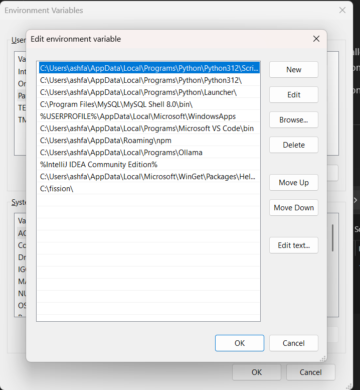

To install Fission on your Windows machine using Minikube, Helm, and kubectl, follow these steps:

### Step 1: Set Up Kubernetes Cluster with Minikube
Ensure your Minikube cluster is up and running:
1. **Start Minikube**:
   ```bash
   minikube start
   ```
2. **Verify Kubernetes Cluster**:
   ```bash
   kubectl version
   ```
   This should show the Kubernetes client and server versions.

### Step 2: Install Fission Using Helm
1. **Create a namespace for Fission**:
   ```bash
   kubectl create namespace fission
   ```
2. **Install Fission CRDs**:
   ```bash
   kubectl create -k "github.com/fission/fission/crds/v1?ref=v1.20.5"
   ```
3. **Add the Fission Helm repository**:
   ```bash
   helm repo add fission-charts https://fission.github.io/fission-charts/
   helm repo update
   ```
4. **Install Fission using Helm**:
   ```bash
   helm install --version v1.20.5 --namespace fission fission fission-charts/fission-all
   ```

### Step 3: Verify Fission Installation
1. **Check Fission version**:
   ```bash
   fission version
   ```
   This should show both the client and server versions.
   
2. **Check Fission core components**:
   ```bash
   fission check
   ```
   This will verify that the Fission core components (executor, router, storage service, webhook) are running fine.

### Step 4: Install Fission CLI on Windows
1. **Option 1 (WSL)**: If you have Windows Subsystem for Linux (WSL) enabled, you can download the Linux binary for Fission CLI and use it within WSL.
2. **Option 2 (Windows)**: You can download the Windows executable (`fission.exe`) from the Fission GitHub releases page and place it in your system's PATH.(implemented)

  [fission.exe link](https://github.com/fission/fission/releases/download/v1.20.5/fission-v1.20.5-windows-amd64.exe)


### Additional Notes:
- Ensure Minikube has sufficient resources (like RAM and CPU) allocated, especially for running Fission on your machine.
- If you are using OpenShift or Docker Desktop, there may be some minor differences in the installation steps.

By following these steps, we should be able to install and verify Fission on our Windows machine using Minikube, Helm, and kubectl.

---

- Adding exe to the path

  - place the exe file in a seperate directory
  
  - Open Environment Variables tab and update in path.
  

  - Verify it
```
C:\Users\ashfa\OneDrive\Desktop\My-Learning\fission\fission>fission version
client:
  fission/core:
    BuildDate: "2024-10-04T07:43:36Z"
    GitCommit: 352090d0
    Version: v1.20.5
server:
  fission/core:
    BuildDate: "2024-10-04T07:43:36Z"
    GitCommit: 352090d0
    Version: v1.20.5  
```

## Command logs 

```
C:\Users\ashfa>minikube start
😄  minikube v1.34.0 on Microsoft Windows 11 Home Single Language 10.0.26100.2605 Build 26100.2605
✨  Using the docker driver based on existing profile
👍  Starting "minikube" primary control-plane node in "minikube" cluster
🚜  Pulling base image v0.0.45 ...
🔄  Restarting existing docker container for "minikube" ...
❗  Failing to connect to https://registry.k8s.io/ from inside the minikube container
💡  To pull new external images, you may need to configure a proxy: https://minikube.sigs.k8s.io/docs/reference/networking/proxy/
🐳  Preparing Kubernetes v1.31.0 on Docker 27.2.0 ...
🔎  Verifying Kubernetes components...
    ▪ Using image gcr.io/k8s-minikube/storage-provisioner:v5
    ▪ Using image docker.io/kubernetesui/dashboard:v2.7.0
    ▪ Using image docker.io/kubernetesui/metrics-scraper:v1.0.8
💡  After the addon is enabled, please run "minikube tunnel" and your ingress resources would be available at "127.0.0.1"
    ▪ Using image registry.k8s.io/ingress-nginx/kube-webhook-certgen:v1.4.3
    ▪ Using image registry.k8s.io/ingress-nginx/controller:v1.11.2
    ▪ Using image registry.k8s.io/ingress-nginx/kube-webhook-certgen:v1.4.3
💡  Some dashboard features require the metrics-server addon. To enable all features please run:

        minikube addons enable metrics-server

🔎  Verifying ingress addon...
🌟  Enabled addons: dashboard, default-storageclass, storage-provisioner, ingress
🏄  Done! kubectl is now configured to use "minikube" cluster and "default" namespace by default

C:\Users\ashfa>minikube docker-env
SET DOCKER_TLS_VERIFY=1
SET DOCKER_HOST=tcp://127.0.0.1:50520
SET DOCKER_CERT_PATH=C:\Users\ashfa\.minikube\certs
SET MINIKUBE_ACTIVE_DOCKERD=minikube
REM To point your shell to minikube's docker-daemon, run:
REM @FOR /f "tokens=*" %i IN ('minikube -p minikube docker-env --shell cmd') DO @%i

C:\Users\ashfa>@FOR /f "tokens=*" %i IN ('minikube -p minikube docker-env --shell cmd') DO @%i

- Download the set the path of the exe file as mentioned above.

C:\Users\ashfa>fission version
client:
  fission/core:
    BuildDate: "2024-10-04T07:43:36Z"
    GitCommit: 352090d0
    Version: v1.20.5
server:
  fission/core:
    BuildDate: "2024-10-04T07:43:36Z"
    GitCommit: 352090d0
    Version: v1.20.5

C:\Users\ashfa>fission check
fission-services
--------------------
√ executor is running fine
√ router is running fine
√ storagesvc is running fine
√ webhook is running fine

fission-version
--------------------
√ fission is up-to-date


C:\Users\ashfa>fission env create --name nodejs --image ghcr.io/fission/node-env
poolsize setting default to 3
environment 'nodejs' created

C:\Users\ashfa>curl -LO https://raw.githubusercontent.com/fission/examples/main/nodejs/hello.js
  % Total    % Received % Xferd  Average Speed   Time    Time     Time  Current
                                 Dload  Upload   Total   Spent    Left  Speed
100   119  100   119    0     0    261      0 --:--:-- --:--:-- --:--:--   262

C:\Users\ashfa>fission function create --name hello-js --env nodejs --code hello.js
Package 'hello-js-7432fd46-7137-469f-ae01-d7f7d8a1b3fc' created
function 'hello-js' created

C:\Users\ashfa>fission function test --name hello-js
hello, world!

C:\Users\ashfa>fission function test --name hello-js
hello, world!

```