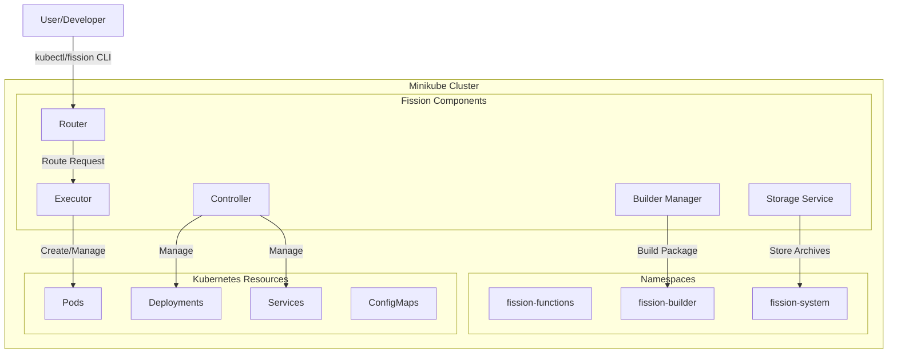

Fission works internally with Minikube and kubectl, including its architecture and components.




How Fission integrates with Minikube and kubectl:

1. Initial Setup and Components:
   - When you install Fission on Minikube, it creates three main namespaces:
     - `fission-system`: Core Fission components
     - `fission-functions`: Where function pods run
     - `fission-builder`: For building function packages

2. Core Components:

   a) Controller:
   - Manages Fission resources (functions, environments, triggers)
   - Interacts with Kubernetes API server
   - Handles lifecycle of function deployments
   
   b) Router:
   - Receives HTTP requests
   - Routes requests to appropriate function pods
   - Handles load balancing and request distribution

   c) Executor:
   - Manages function pod lifecycle
   - Implements specialized execution strategies
   - Handles pod pooling and scaling

3. Interaction Flow:

```plaintext
User Request → Minikube Ingress → Fission Router → Function Pod → Response
```

4. Integration with kubectl:
   ```bash
   # View Fission components
   kubectl get pods -n fission-system
   
   # Check function pods
   kubectl get pods -n fission-functions
   
   # Monitor builder pods
   kubectl get pods -n fission-builder
   ```

5. Resource Management:
   - Fission creates Kubernetes resources:
     - Deployments for function pods
     - Services for routing
     - ConfigMaps for configurations
     - Secrets for sensitive data

6. Function Lifecycle:
   ```plaintext
   1. Function Created → 2. Package Built → 3. Pod Created → 4. Ready for Requests
   ```

7. Common Operations with kubectl:
   ```bash
   # Check Fission services
   kubectl get svc -n fission-system
   
   # View function logs
   kubectl logs -n fission-functions <pod-name>
   
   # Check Fission events
   kubectl get events -n fission-system
   ```


# Fission Internal Operations with Minikube

## 1. Startup Process

### Initial Bootstrap
```bash
# Fission installation creates
- Namespaces (fission-system, fission-functions, fission-builder)
- CRDs (Custom Resource Definitions)
- Core components (controller, router, executor)
```

### Component Initialization
```yaml
# Controller initialization
1. Register CRDs
2. Start informers
3. Initialize reconciliation loops

# Router initialization
1. Setup HTTP servers
2. Initialize function cache
3. Start metrics collection

# Executor initialization
1. Setup pod pools
2. Initialize autoscaler
3. Start cleanup routines
```

## 2. Function Deployment Process

### Package Building
```yaml
steps:
  1. Source code uploaded
  2. Builder pod created
  3. Dependencies installed
  4. Package archived
  5. Ready for deployment
```

### Pod Creation
```yaml
process:
  1. Environment container pulled
  2. Function package mounted
  3. Runtime configured
  4. Health checks established
  5. Pod marked ready
```

## 3. Request Handling

### Router Operations
```yaml
steps:
  1. Receive HTTP request
  2. Look up function
  3. Select target pod
  4. Forward request
  5. Return response
```

### Executor Operations
```yaml
activities:
  1. Monitor pod health
  2. Handle scaling
  3. Manage pod lifecycle
  4. Clean up inactive pods
```

## 4. Resource Management

### Pod Pooling
```yaml
configuration:
  warmPods: 
    min: 1
    max: 5
  cooldownPeriod: 5m
  scaleZero: true
```

### Autoscaling
```yaml
metrics:
  - CPU utilization
  - Request count
  - Response time
triggers:
  - Scale up: High load
  - Scale down: Low utilization
```


Important points about Fission's internal workings:

1. Specialized Storage:
   - Functions are stored as packages
   - Configurations stored in etcd
   - Logs managed by Kubernetes

2. Performance Optimizations:
   - Pod pooling for fast scaling
   - Function specialization
   - Request queuing

3. High Availability:
   - Component redundancy
   - Automatic failover
   - State recovery

