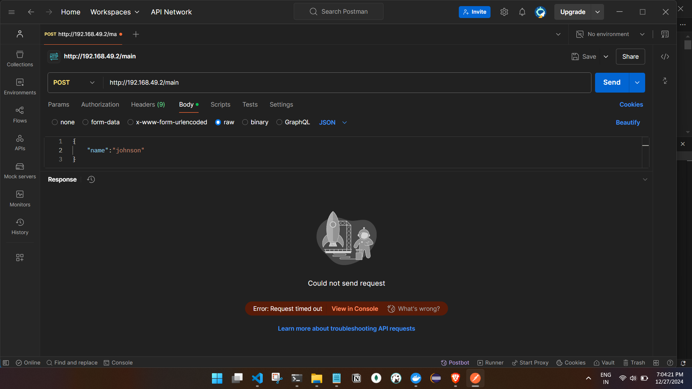

- Command line

```

C:\Users\ashfa\OneDrive\Desktop\My-Learning\fission\fission\samples\python\P1>fission env create --name py-env --image fission/python-env
poolsize setting default to 3
environment 'py-env' created

C:\Users\ashfa\OneDrive\Desktop\My-Learning\fission\fission\samples\python\P1>fission fn create --name main --code main.py --entrypoint main.main --env py-env
Package 'main-076c390d-2055-43eb-a8f3-14a84029609d' created
function 'main' created

C:\Users\ashfa\OneDrive\Desktop\My-Learning\fission\fission\samples\python\P1>fission fn test --name main  --body='{"name":"John"}' --method POST
Request that we received is: '{name:John}'
C:\Users\ashfa\OneDrive\Desktop\My-Learning\fission\fission\samples\python\P1>fission ht create --name main --url  /main --method POST  --function main --createingress=true
trigger 'main' created

C:\Users\ashfa\OneDrive\Desktop\My-Learning\fission\fission\samples\python\P1>minikube addons enable ingress
💡  ingress is an addon maintained by Kubernetes. For any concerns contact minikube on GitHub.
You can view the list of minikube maintainers at: https://github.com/kubernetes/minikube/blob/master/OWNERS
💡  After the addon is enabled, please run "minikube tunnel" and your ingress resources would be available at "127.0.0.1"
    ▪ Using image registry.k8s.io/ingress-nginx/kube-webhook-certgen:v1.4.3
    ▪ Using image registry.k8s.io/ingress-nginx/controller:v1.11.2
    ▪ Using image registry.k8s.io/ingress-nginx/kube-webhook-certgen:v1.4.3
🔎  Verifying ingress addon...
🌟  The 'ingress' addon is enabled

C:\Users\ashfa\OneDrive\Desktop\My-Learning\fission\fission\samples\python\P1>


```
- Tried calling from api but request timeout as usual,same happened for Java.

